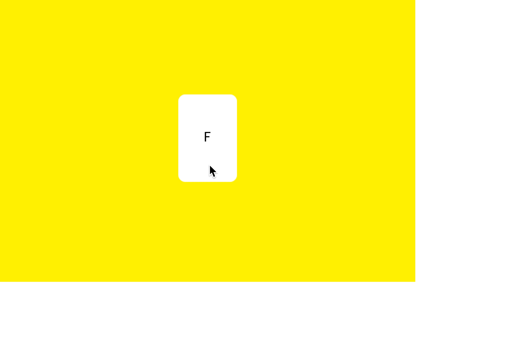
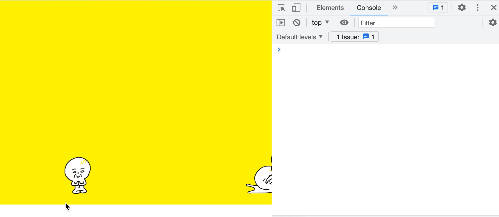
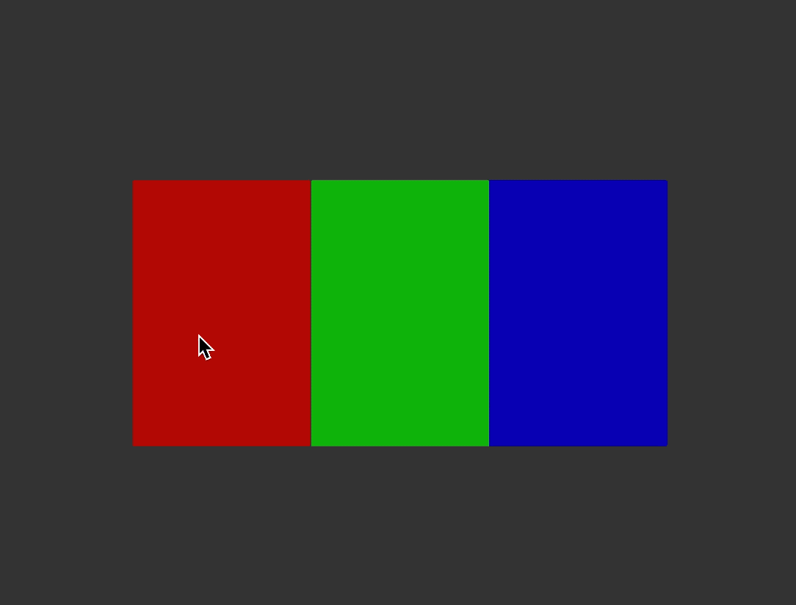

# Interactive Web 개발 시작하기

> 💡 1분코딩의 [인터랙티브 웹 개발 제대로 시작하기](https://www.inflearn.com/course/interactive_web/dashboard) 강의를 듣고 정리한 내용입니다.
# CSS 3D
카드에 마우스를 올리면 카드가 뒤집어짐

# event
움직이는 일분이를 클릭하면 일분이가 사라짐

# 3개의문
문을 클릭하면 문이 열리면서 일분이가 나옴

# 전진! 3D 스크롤